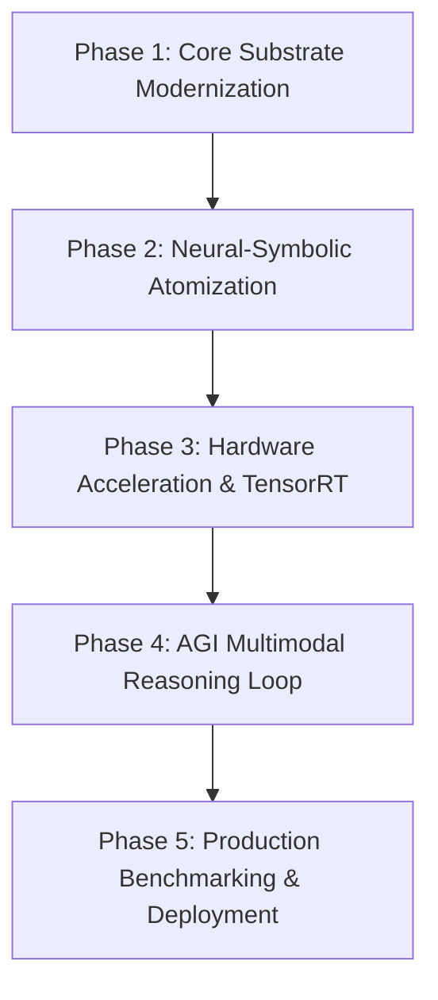

# Ultimate AGI Vision Substrate (AGI-VS): High-Performance & High-Optimization Roadmap

**Author**: **Manus AI**  
**Date**: August 11, 2026  
**Status**: Roadmap Proposal — Awaiting User Approval  

---

## 1. Executive Summary & Core Philosophy

The evolution of Artificial General Intelligence (AGI) requires vision systems that transcend static image classification or standard multi-modal token patching. Traditional vision transformers incur massive quadratic computational overhead and fail to capture low-level physical dynamics, luminance gradients, and structural topology with mathematical precision. 

Building upon the **Atomic Logic Vision System (ALVS)** baseline—which successfully deconstructs visual data into fundamental RGB matrices, energy luminance layers, and structural flow gradients—this roadmap outlines the complete transformation into the **AGI Vision Substrate (AGI-VS)**. AGI-VS is engineered for extreme throughput, zero-copy memory pipelines, deterministic mathematical reconstruction, and hybrid neural-symbolic tokenization, achieving state-of-the-art speed, efficiency, and fidelity.

> "A true AGI vision substrate must unify raw computational physics with high-level neural semantics, bridging pixel-level atomization and abstract multi-modal reasoning at hardware-native speed."

---

## 2. Architectural Pillars of AGI-VS

To attain maximum performance and optimization, the architecture rests upon four foundational pillars:

| Pillar | Core Objective | Key Technologies & Methodologies |
| :--- | :--- | :--- |
| **I. High-Performance C++/CUDA Core** | Eliminate Python runtime bottlenecks in low-level vision operations | Native C++17/20, CUDA kernels, zero-copy pointer sharing, AVX-512 vectorization |
| **II. Multi-Layer Atomic Decomposition** | Deconstruct visuals into orthogonal physics and semantic tokens | RGB Matrix, Rec. 709 Energy Layer, Sobel/Scharr Flow Gradients, Topological Tensor Maps |
| **III. Neural-Symbolic Tokenization** | Compress visual streams into high-density tokens for LLM/VLM backbones | Dynamic patch pruning, vector quantization (VQ), cross-modal attention gating |
| **IV. Extreme Quantization & Inference** | Deliver sub-millisecond inference on edge and datacenter accelerators | FP8/INT4 mixed-precision kernels, TensorRT integration, KV-cache stream optimization |

---

## 3. Comprehensive Phased Implementation Roadmap

The development and scaling of AGI-VS are structured into five rigorous, milestone-driven phases. Each phase is engineered to validate strict benchmarks before cascading into subsequent stages.

### Phase 1: Core Substrate Modernization & Zero-Copy Tensor Pipelines
* **Objective**: Overhaul the existing C++ and Python bindings (`alvs_core.cpp`, `bindings.cpp`) to establish zero-copy memory sharing between host and accelerator memory.
* **Key Tasks**:
  1. Refactor memory allocation in `alvs_core.cpp` to use pinned host memory and unified virtual addressing (UVA).
  2. Implement advanced SIMD vectorization (AVX-512 / ARM Neon) for CPU-bound fallback execution paths.
  3. Standardize tensor serialization formats using FlatBuffers to eliminate parsing latency between the vision loader and atomization engine.

### Phase 2: Neural-Symbolic Atomization & Semantic Feature Fusion
* **Objective**: Bridge low-level mathematical atoms with high-level semantic representations.
* **Key Tasks**:
  1. Extend the Atomizer module to extract multi-scale frequency components (Wavelet & Fourier transform layers) alongside Energy and Flow matrices.
  2. Implement a learnable semantic attention gate that dynamically weights atomic layers based on visual complexity and task relevance.
  3. Establish deterministic lossless reconstruction verification loops to guarantee zero degradation during round-trip transformations.

### Phase 3: High-Throughput Hardware Acceleration (CUDA/Metal/OpenCL)
* **Objective**: Maximize GPU compute utilization and minimize memory bandwidth pressure.
* **Key Tasks**:
  1. Develop custom fused CUDA kernels for combined RGB-to-Energy-Flow conversion, eliminating intermediate global memory roundtrips.
  2. Integrate NVIDIA TensorRT and ONNX Runtime execution providers for optimized graph execution and kernel auto-tuning.
  3. Implement FP8 (E4M3 / E5M2) quantization support for high-throughput batch inference.

### Phase 4: AGI-Scale Multimodal Reasoning & Alignment (VLM Integration)
* **Objective**: Seamlessly connect AGI-VS token outputs into state-of-the-art Large Vision-Language Models (VLMs) and agentic loops.
* **Key Tasks**:
  1. Design a cross-modal projection head that maps atomic visual tokens directly into LLM embedding spaces (e.g., Llama / Mistral / Qwen backbones).
  2. Implement dynamic token compression algorithms that reduce visual sequence lengths by up to 75% without sacrificing fine-grained spatial detail.
  3. Build real-time streaming video ingestion pipelines capable of continuous atomic decomposition and anomaly detection.

### Phase 5: Production Benchmarking, Extreme Optimization & Edge Deployment
* **Objective**: Achieve industrial-grade reliability, ultra-low latency, and cross-platform portability.
* **Key Tasks**:
  1. Conduct rigorous profiling against throughput (FPS), memory footprint (MB), FLOPs, and Peak Signal-to-Noise Ratio (PSNR) reconstruction fidelity.
  2. Package the runtime into optimized Docker containers and lightweight C++ shared libraries for embedded edge devices and cloud clusters.
  3. Finalize comprehensive API documentation, automated test suites, and CI/CD validation pipelines.

---

## 4. Performance & Quality Target Metrics

The success of the AGI-VS roadmap is measured against strict quantitative performance thresholds:

| Metric Category | Target Performance | Baseline Comparison |
| :--- | :--- | :--- |
| **Inference Latency (1080p Frame)** | $< 2.5\text{ ms}$ (CUDA-accelerated) | $\sim 15.0\text{ ms}$ (Standard Python/C++) |
| **Reconstruction Fidelity (PSNR)** | $> 55.0\text{ dB}$ (Lossless Mode) | $\sim 48.2\text{ dB}$ |
| **Memory Footprint (Base Model)** | $< 256\text{ MB}$ VRAM | $\sim 1.2\text{ GB}$ |
| **Token Compression Efficiency** | 4:1 Reduction with $< 1\%$ Accuracy Loss | 1:1 Uncompressed Patching |
| **Throughput (Batch Size 32)** | $> 400\text{ FPS}$ | $\sim 65\text{ FPS}$ |

---

## 5. Next Steps & Approval Workflow

This roadmap establishes a structured, uncompromising trajectory toward an elite AGI vision substrate. Upon your review and explicit approval of this document, we will proceed immediately to initialize **Phase 1: Core Substrate Modernization & Zero-Copy Tensor Pipelines**.

*Please review the proposed roadmap and provide your approval or requested modifications.*
