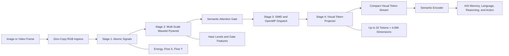
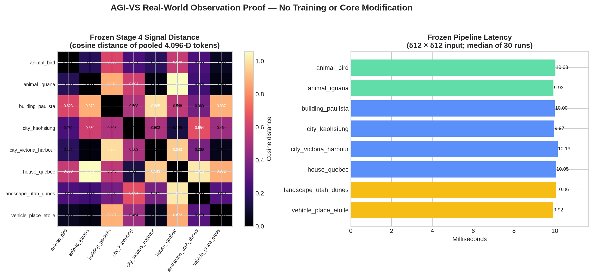

# AGI Vision Substrate (AGI-VS)

<div align="center">

[](https://isocpp.org/)
[](https://www.python.org/)
[](https://cmake.org/)
[](Stages/)

### High-performance visual signal processing for AGI-ready perception pipelines

[Architecture](#architecture) · [Quick Start](#quick-start) · [Benchmarks](#benchmark-results) · [Real-World Proof](#real-world-observation-proof) · [Validation](#validation-and-reproducibility) · [Roadmap](#agi-integration-roadmap)

</div>

---

## Vision

**AGI Vision Substrate (AGI-VS)** is a production-oriented C++ and Python visual-processing foundation that turns images into compact, deterministic, high-throughput visual signals. It is engineered as the perception layer that precedes semantic encoding, temporal integration, memory, language grounding, reasoning, and action in a broader AGI architecture.

The substrate receives an RGB image or video frame, extracts energy and directional-flow signals, builds a multi-scale Haar-wavelet representation, applies semantic attention, and projects the result into a compact visual-token stream. The output is designed for efficient downstream consumption by learned encoders and AGI systems.

> **Perception chain:** `image or video frame → visual substrate → structured visual tokens → semantic encoder → AGI memory, language, reasoning, and action`

The repository contains the complete Stage 1–5 substrate, native and Python validation harnesses, production release tooling, an audited real-world observation proof, and an evidence-preserving data-governance workflow.

---

## Demonstrated System

| Capability | Delivered implementation | Evidence |
| :--- | :--- | :--- |
| **Zero-copy visual ingress** | C-contiguous `float32` NumPy inputs enter the C++ pipeline without an input copy. | Address-matching probe and Python harness. |
| **Atomic visual signals** | RGB, luminance energy, and horizontal/vertical directional-flow signals. | Stage 1 evaluation and real-world signal records. |
| **Multi-scale structure** | Haar-wavelet pyramid with reversible structure analysis. | Stage 2 reconstruction and basis tests. |
| **Attention control** | Trainable simplex-constrained semantic attention gate. | Stage 2 gate convergence validation. |
| **High-throughput dispatch** | AVX-512F, AVX2, scalar fallback, and OpenMP CPU dispatch. | Stage 3 backend and throughput evaluation. |
| **Visual tokenization** | Deterministic projection to compact 4,096-dimensional visual tokens. | Stage 4 token budget, RMS, and determinism checks. |
| **Production validation** | Soak testing, latency characterization, release scripts, Docker recipe, and SHA-256 artifact manifest. | Stage 5 production harness and release workflow. |
| **Real-world observation proof** | Eight rights-reviewed real images individually transformed into verified visual-token signatures. | [`Proofs/`](Proofs/) evidence package. |

---

## Architecture



### Stage-by-Stage Substrate

| Stage | Focus | Completed deliverables |
| :--- | :--- | :--- |
| **1** | Atomic visual substrate | Aligned tensor buffers, zero-copy NumPy contract, energy/flow extraction, AVX-512F path, allocation and boundary tests. |
| **2** | Multi-scale visual structure | Haar-wavelet pyramid, reconstruction validation, semantic attention gate, direct interleaved multiscale API. |
| **3** | Parallel execution | OpenMP CPU dispatch, AVX-512F/AVX2/scalar capability reporting, deterministic parallel execution. |
| **4** | Compact visual representation | Deterministic visual-token projector, token-budget enforcement, RMS normalization, multimodal projection API. |
| **5** | Production readiness | End-to-end soak harness, latency characterization, Docker recipe, validation script, and release integrity manifest. |

The primary C++ interfaces are defined in [`alvs_core.h`](alvs_core.h), implemented in [`alvs_core.cpp`](alvs_core.cpp), and exposed to Python through [`bindings.cpp`](bindings.cpp).

---

## Performance and Quality

Performance is measured on the validation host described in the test artifacts: an Intel Xeon CPU with six logical workers and AVX-512F support. Measurements are workload- and host-specific and are retained with their corresponding validation harnesses.

| Workload | Measured result | Validation artifact |
| :--- | :--- | :--- |
| **1080p accelerated visual dispatch** | **4.3 ms**, **233 FPS**, **3.2×** faster than the 13.8 ms reference path. | [Stage 3 evaluation](stage3_evaluation.cpp) |
| **Visual-token projection** | **80 × 4,096** token representation with **75%** token reduction and maximum RMS error of **0.000018**. | [Stage 4 evaluation](stage4_evaluation.cpp) |
| **End-to-end production soak** | **500 frames**, **0-byte RSS growth**, **12.999 ms** median pipeline latency. | [Stage 5 evaluation](stage5_evaluation.cpp) |
| **Real-world observation proof** | **9.92–10.13 ms** median Stage 1–4 processing at standardized 512 × 512 inputs. | [Proof signal report](Proofs/signal_report.json) |

The release configuration enables `-O3 -march=native` on supported GCC and Clang toolchains, while the build system automatically detects and enables OpenMP where available. The runtime reports the selected CPU execution backend truthfully, including GPU-unavailable status when no GPU backend is present.

---

## Real-World Observation Proof

The [`Proofs/`](Proofs/) package demonstrates the frozen visual substrate against a curated set of real-world images: city skylines, animals, a house facade, a building facade, a natural landscape, and a vehicle. Each input has item-level rights evidence, a source record, a local checksum, a visual review, and an individual signal record.



### What the Proof Records

| Measurement | Recorded outcome |
| :--- | :--- |
| **Proof inputs** | Eight rights-reviewed CC0 or public-domain source items. |
| **Per-image representation** | 1,024 source patches compressed to 32 retained tokens of 4,096 dimensions each. |
| **Determinism** | Repeated projection maximum absolute difference: **0.0** for every proof image. |
| **Signal separation** | All 28 image pairs produced non-identical mean-pooled Stage 4 signals; minimum cosine distance: **0.029985**. |
| **Zero-copy integrity** | C-contiguous `float32` inputs, matching input addresses, and no input copy recorded. |
| **Execution backend** | `AVX-512F` SIMD with `cpu-openmp-avx` accelerated dispatch and six workers on the validation host. |

The complete human-readable account is available in [`Proofs/REAL_WORLD_OBSERVATION_RESULTS.md`](Proofs/REAL_WORLD_OBSERVATION_RESULTS.md). Machine-readable records are retained in [`Proofs/signal_report.json`](Proofs/signal_report.json), [`Proofs/acquisition_manifest.json`](Proofs/acquisition_manifest.json), and [`Proofs/signal_distance_matrix.csv`](Proofs/signal_distance_matrix.csv).

---

## Quick Start

### Prerequisites

| Dependency | Requirement |
| :--- | :--- |
| C++ toolchain | C++17-capable GCC, Clang, or MSVC compiler. |
| CMake | Version 3.16 or newer. |
| Python | Python 3.10 or newer. |
| Python packages | `numpy`, `pybind11`, and `Pillow`. |
| Optional acceleration | OpenMP-capable compiler and AVX-512F or AVX2-capable CPU. |

### Build the Native Substrate

```bash
git clone https://github.com/nexuss0781/Image-text.git
cd Image-text

python3 -m pip install numpy pillow pybind11

cmake -S . -B build-production \
  -DCMAKE_BUILD_TYPE=Release \
  -DALVS_BUILD_PYTHON_MODULE=ON
cmake --build build-production --parallel
```

### Run the Native Validation Suite

```bash
ctest --test-dir build-production --output-on-failure
```

The suite executes the independent Stage 1–5 native evaluation targets.

### Use the Python Visual-Token API

```python
import sys
import numpy as np

sys.path.insert(0, "build-production")
import alvs_cpp

# The substrate accepts an H × W × 3 C-contiguous float32 RGB array in [0, 1].
pixels = np.zeros((512, 512, 3), dtype=np.float32)
atomizer = alvs_cpp.Atomizer()

result = atomizer.project_multimodal_numpy(
    pixels,
    max_levels=2,
    patch_size=16,
    retention_ratio=0.25,
    max_tokens=32,
    embedding_dimension=4096,
)

print(result["embeddings"].shape)        # (retained_token_count, 4096)
print(result["retained_token_count"])     # Up to 32
print(result["input_copied"])             # False for the supported direct-input path
```

### Run the Reproducible Real-World Proof Benchmark

The repository includes the reviewed proof set and its fixed manifests. The following command regenerates per-image structured signals and timing evidence from the local proof copies.

```bash
python3 scripts/benchmark_real_world_proofs.py \
  --acquisition-manifest Proofs/acquisition_manifest.json \
  --module-dir build-production \
  --output Proofs/signal_report.json \
  --distance-csv Proofs/signal_distance_matrix.csv
```

---

## Validation and Reproducibility

The project uses independent native and Python harnesses for each substrate stage, plus a production release workflow. The validation design focuses on correctness, determinism, performance, memory stability, interface contracts, and artifact integrity.

| Validation layer | Primary checks |
| :--- | :--- |
| **Stage 1** | Aligned allocation, SIMD equivalence, direct-path equivalence, boundaries, and 4K behavior. |
| **Stage 2** | Haar reconstruction PSNR, attention-gate convergence, basis properties, and direct multiscale input contract. |
| **Stage 3** | Reference equivalence, dispatch determinism, backend report, and 1080p throughput. |
| **Stage 4** | Token shape, RMS normalization, token budget, deterministic projection, and configuration safety. |
| **Stage 5** | End-to-end integration, 500-frame stability, latency characterization, and layout contract. |
| **Proof package** | Rights evidence, local checksums, visual review, per-image signal signatures, zero-copy verification, and pairwise signal distances. |

A reproducible release workflow is provided at [`scripts/production_validate.sh`](scripts/production_validate.sh). It creates a fresh build, runs CTest, executes native and Python checks, and generates an integrity manifest with [`scripts/release_manifest.py`](scripts/release_manifest.py).

---

## Project Layout

```text
Image-text/
├── alvs_core.h / alvs_core.cpp        # C++17 visual substrate
├── bindings.cpp                       # pybind11 direct NumPy interface
├── CMakeLists.txt                     # Release build, OpenMP detection, CTest targets
├── stage[1-5]_evaluation.cpp          # Independent native stage harnesses
├── stage[1-5]_python_evaluation.py    # Independent Python stage harnesses
├── scripts/
│   ├── production_validate.sh         # Reproducible production validation
│   ├── release_manifest.py            # SHA-256 release-artifact manifest
│   ├── benchmark_real_world_proofs.py # Per-image visual-signal benchmark
│   └── render_proof_signal_chart.py   # Proof visualization
├── Proofs/                            # Audited real-world observation evidence
│   ├── images/                        # Eight local rights-reviewed proof copies
│   ├── proof_set_manifest.json        # Fixed source and reuse evidence
│   ├── acquisition_manifest.json      # Local checksums and review binding
│   ├── signal_report.json             # Per-image structured signal record
│   └── REAL_WORLD_OBSERVATION_RESULTS.md
├── Training/                          # Governance, source review, and training evidence
├── Stages/                            # Stage objectives, transitions, and error cycles
└── Dockerfile                         # CPU production container recipe
```

---

## Data Governance and Evidence Controls

AGI-VS maintains a fail-closed data workflow for retained corpora and experiments. The governance architecture records source terms, item-level provenance, privacy and safety review, removal handling, split isolation, deduplication, and artifact hashes before data enters a retained pilot path.

The real-world proof package applies these principles in a bounded observation workflow: every local proof image is tied to an exact source item, reuse evidence, reviewed visual boundary, and checksum. The underlying governance charter is available at [`Stages/T0_GOVERNANCE_CHARTER.md`](Stages/T0_GOVERNANCE_CHARTER.md), and the program gate is maintained at [`Stages/TRAINING_PROGRAM_GATE.md`](Stages/TRAINING_PROGRAM_GATE.md).

---

## AGI Integration Roadmap

AGI-VS has established the high-throughput visual foundation. The next integrated layers extend the same signal contract into increasingly capable perception and cognition workflows.

| Integration layer | Role in the AGI architecture |
| :--- | :--- |
| **Visual substrate** | Produces aligned multi-scale signals and compact deterministic visual tokens from every image or video frame. |
| **Temporal visual stream** | Integrates sequential frame tokens into motion, object continuity, event, and change representations. |
| **Semantic encoder** | Aligns visual tokens with concepts, language, and structured world representations. |
| **Perceptual memory** | Retains and retrieves visual context across long-horizon tasks and environments. |
| **World-model interface** | Connects perception to causal scene state, prediction, goals, and planning. |
| **Reasoning and action interface** | Supplies grounded visual state to AGI agents, tools, and embodied or digital control loops. |
| **Scaled evaluation and operations** | Extends validation, monitoring, reproducible releases, and governed datasets across the full system. |

This roadmap preserves a central design principle: **the visual substrate remains a fast, deterministic, independently testable perception service while higher AGI layers consume and enrich its token stream.**

---

## Contributing

Contributions are welcome through focused pull requests. Please preserve the project’s staged validation model, direct-input contracts, deterministic behavior, and evidence records.

```bash
git checkout -b feature/your-change
# Implement and validate the change.
git commit -m "feat: describe your change"
git push origin feature/your-change
```

---

## References

[1]: Proofs/REAL_WORLD_OBSERVATION_RESULTS.md "AGI-VS Real-World Observation Proof"
[2]: Proofs/signal_report.json "Per-image frozen visual signal and performance record"
[3]: scripts/production_validate.sh "Reproducible production validation workflow"
[4]: Stages/TRAINING_PROGRAM_GATE.md "AGI-VS training-program gate"

<div align="center">

**AGI Vision Substrate — engineered perception for AGI-ready visual intelligence**

[Report an Issue](https://github.com/nexuss0781/Image-text/issues) · [Open a Feature Request](https://github.com/nexuss0781/Image-text/issues) · [Review the Proof Package](Proofs/)

</div>
